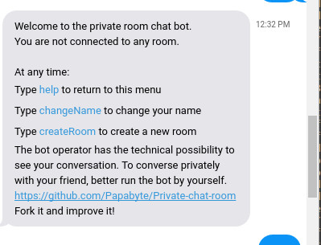
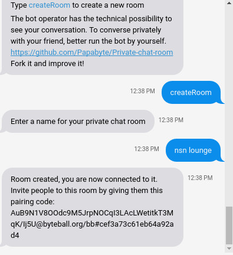

# byteball-private-chat-room

This is a documentation to help you to run your own private chat room chatbot.

## Introduction

This chatbot allows several persons to chat together using the Byteball messaging system. The bot decrypts messages and relays them to others users after reencryption. 
Since the messages are not anymore encrypted end-to-end, it is recommended to operate this bot by yourself instead of relying on a third party. Since it's based on a light headless wallet, any cheap VPS should be able to run it.


 


## Get started

- [Install nodeJS](https://www.digitalocean.com/community/tutorials/how-to-install-node-js-on-debian-8)
- apt-get install git
- git clone https://github.com/Papabyte/Private-chat-room
- npm install
- node chat.js

At first start you will be asked to enter a device name and a passphase.

It should give you a pairing code as below:
```
====== my pairing code: AuB9N1V8OOdc9M5JrpNOCqI3LAcLWetitkT3MqK/Ij5U@byteball.org/bb#0000
```

Pair with the bot, create a chat room then give to your friend the custom pairing code allowing them to join the room you've created.

## Configuration
In conf.js file, you can set the following variables according to your preference:

```
exports.echoDisabled = false;
```
When false, the user will see his posted message. When true, no echo will be received.


```
exports.usersAllowedToCreateRoom = [''];
```
If array empty, anybody can create a chat room. If it contains at least 1 address, room creation is restricted to device addresses present in array.